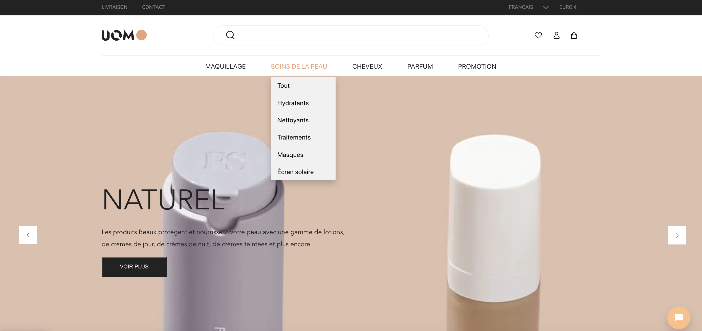
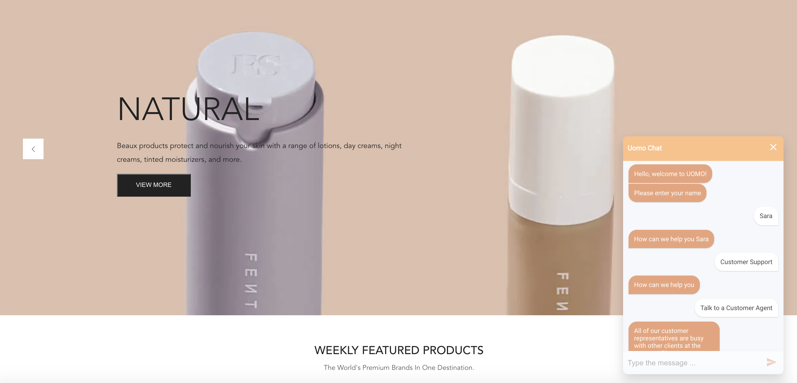
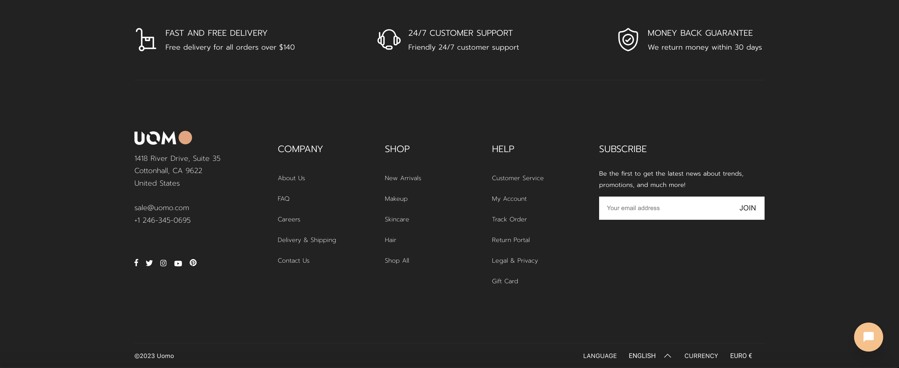
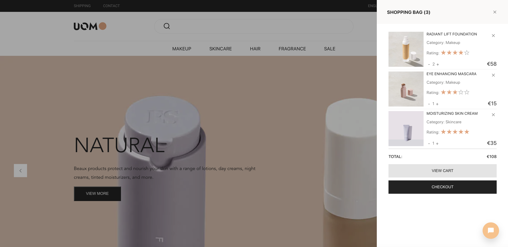
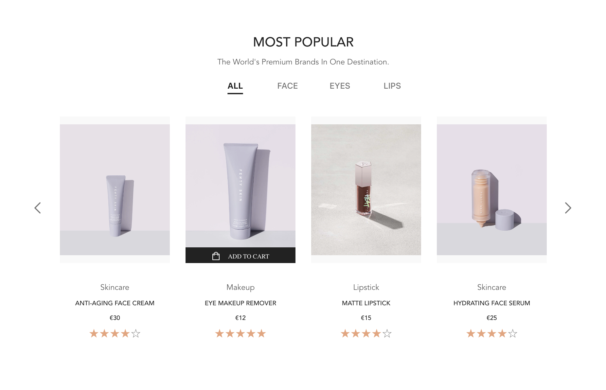

<h1> ShopFront </h1>

A front end website built using React, CSS and with a JSON server.

# General Info

This is a project built and developed in around 6 weeks by 6 software developers who recently all graduated from Boolean Tech Academy and share a passion to want to continue their learning journey, gain experience working as a team in an agile-scrum setting and challenges themselves. 
The design for ShopFront came from an existing Figma template which we reworked and tweaked. 
The MVP consisted of a Landing Page with HeroBanner, Product carousel, NavBar and Footer as well as a Login/ Register feature and Shopping cart feature.

# Special Features 

Some new areas of learning for us were:

## The language feature using 'react-i18next': 
i18next is a JavaScript i18n framework that manages translations for multilingual apps. It initialises with config, supports dynamic language changes based on the app's state, and targets values in JSON files using a simple function.

## Creating interactive chatbot interfaces using 'react-simple-chatbot':
With this library, we defined chatbot conversations using a straightforward configuration. It allowed us to customize the chatbot's appearance and behavior, making it easy to prompt users, receive responses, and take actions like redirection. "react-simple-chatbot" seamlessly integrated into our React project, enhancing user engagement.

# Additional Features

## Login/Register & Newsletter Subscription using 'db.json':
The JSON file "db.json" contains subscription data, and it can be served as an API using the "json-server" with the command: `npm run server`. This allows developers to simulate and interact with a RESTful API for managing 
subscriptions.

## Shopping Bag key features:

1. Add products to the cart
2. Remove products from the cart
3. Update quantities
4. Calculate the total cost

## Product Carousel key features:

1. Eye-catching visual display
2. User-friendly navigation with intuitive controls
3. Customization options to match your brand
4. Dynamic content loading for improved performance

## How to view the website:

1.  Open terminal
2.  `git clone https://github.com/desokan/ShopFront_Frontend.git`
3.  `cd ShopFront_Frontend`
4.  `npm install`
5.  `npm start`
6.   Open [http://localhost:3000](http://localhost:3000) to view it in your browser.
7.  `npm run server`

